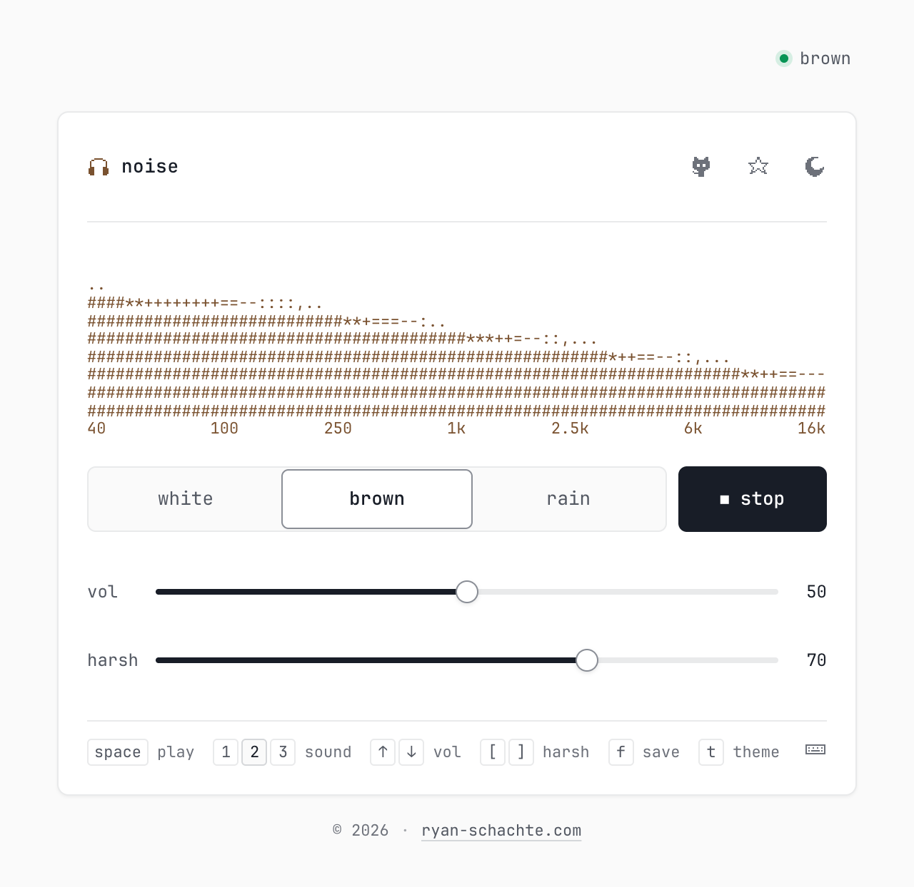

<div align="center">


# noise

white, brown and rain noise in the browser

[](https://noise.ryan-schachte.com)
[](https://news.ycombinator.com/item?id=49890924)
[](LICENSE)

<br />

<a href="https://noise.ryan-schachte.com">
  
</a>

</div>

All sound is generated in the browser with the Web Audio API. No audio files, no dependencies. It works offline and installs as an app on phones.

## Keyboard shortcuts

| Key | Action |
| --- | --- |
| <kbd>Space</kbd> | Play / stop |
| <kbd>1</kbd> <kbd>2</kbd> <kbd>3</kbd> | White / brown / rain |
| <kbd>↑</kbd> <kbd>↓</kbd> | Volume |
| <kbd>[</kbd> <kbd>]</kbd> | Harshness |
| <kbd>f</kbd> | Save or remove preset |
| <kbd>t</kbd> | Toggle theme |

Single-key shortcuts can be turned off with the keyboard icon in the app.

## How the sounds are made

- **White**: random samples in a looped buffer.
- **Brown**: white noise through a leaky integrator, which gives a 1/f² spectrum.
- **Rain**: a 12-second seamless stereo loop made of band-limited pink noise for the wash, a few hundred resonant drop ticks per second, occasional water "plinks", and some low rumble. See [`src/rain.ts`](src/rain.ts).

All three go through a low-pass filter and a presence boost, which is what the harshness slider moves.

The live count in the footer is a Durable Object that holds one WebSocket per open tab ([`worker/index.ts`](worker/index.ts)). It stores nothing about visitors.

## Run locally

```sh
npm install
npm run dev
```

## Deploy

The app is a static build plus a tiny Worker for the live count. `wrangler.jsonc` serves `dist/` as static assets on Cloudflare Workers:

```sh
npm run deploy
```

That ships to your default account on a `*.workers.dev` URL. For your own account or domain, copy it to `wrangler.local.jsonc` (gitignored) and add your details:

```jsonc
{
  "$schema": "node_modules/wrangler/config-schema.json",
  "name": "noise",
  "account_id": "<your-account-id>",
  "compatibility_date": "2026-09-01",
  "main": "worker/index.ts",
  "assets": {
    "directory": "./dist",
    "binding": "ASSETS",
    "not_found_handling": "single-page-application",
    "run_worker_first": ["/presence", "/api/*"]
  },
  "durable_objects": { "bindings": [{ "name": "PRESENCE", "class_name": "Presence" }] },
  "migrations": [{ "tag": "v1", "new_sqlite_classes": ["Presence"] }],
  "routes": [{ "pattern": "noise.example.com", "custom_domain": true }]
}
```

```sh
npm run deploy:local
```

## License

[MIT](LICENSE)
